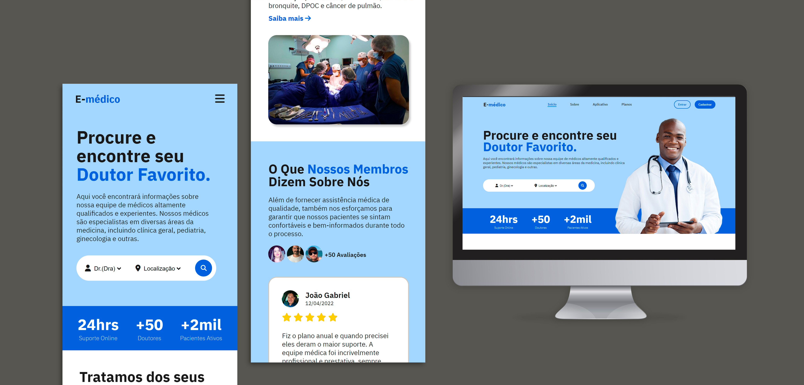

# E-médico (site)

## | Sobre
Este projeto tem como objetivo a criação de um site simples e elegante, usando HTML, CSS e Javascript para criar uma estrutura clara e fácil de navegar, com um design atraente e responsivo que se adapta a diferentes tamanhos de tela. 

## | Objetivo
O site tem como objetivo apresentar e os benefícios de utilizar a plataforma. Você poderá marcar uma consulta com o seu médico de preferência. A plataforma oferece dezenas de profissionais especialistas para um melhor atendimento.

## | Tecnologias utilizadas:

 
  
  
  

